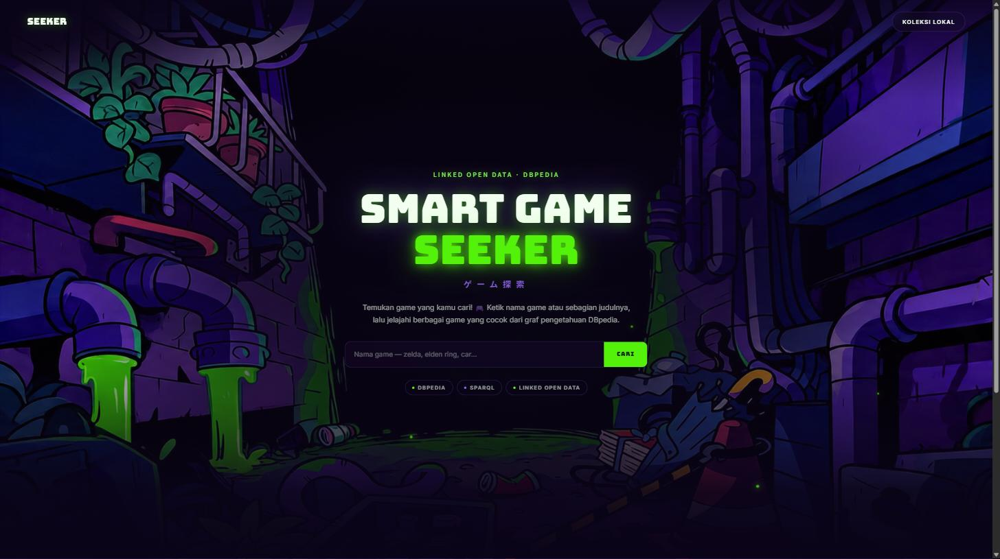
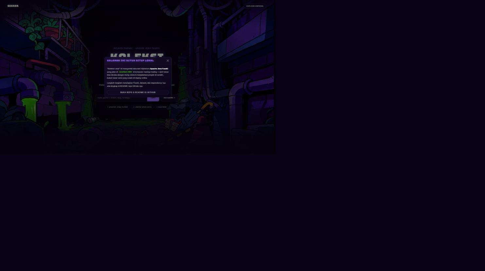
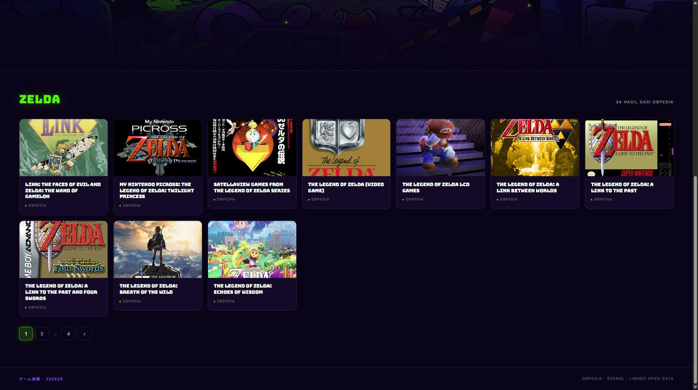
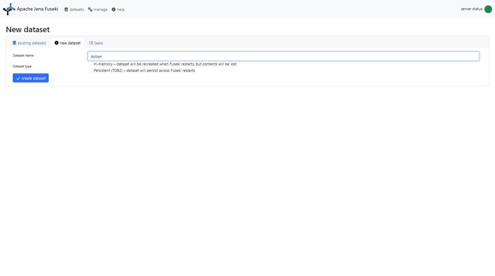
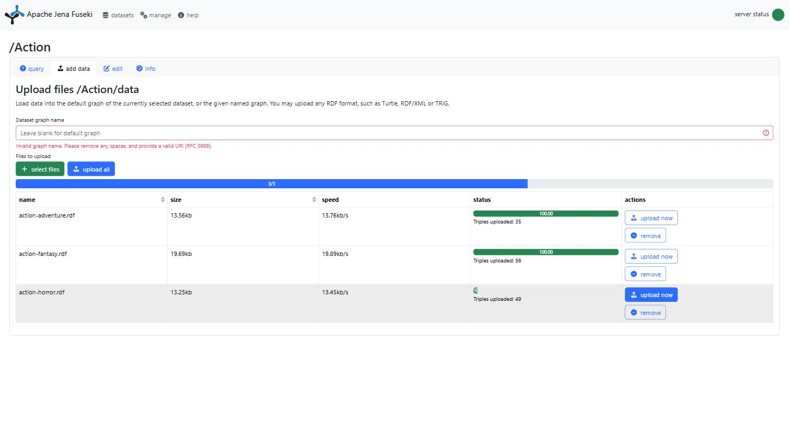

# Smart Game Seeker — Semantic Game Explorer

Aplikasi web pencarian & eksplorasi data video game menggunakan **teknologi web
semantik**: RDF, SPARQL, dan Linked Open Data. Dibuat untuk tugas besar mata
kuliah Web Semantik.

**🌐 Demo online:** https://semantic-game-explorer.infinityfreeapp.com/index.php



## Daftar isi

- [Tentang proyek](#tentang-proyek)
- [Fitur](#fitur)
- [Teknologi](#teknologi)
- [Struktur folder](#struktur-folder)
- [Menjalankan proyek](#menjalankan-proyek)
  - [A. Cepat — hanya fitur pencarian DBpedia](#a-cepat--hanya-fitur-pencarian-dbpedia)
  - [B. Lengkap — termasuk Koleksi Lokal (Fuseki)](#b-lengkap--termasuk-koleksi-lokal-fuseki)
- [Troubleshooting](#troubleshooting)
- [Sumber data & lisensi](#sumber-data--lisensi)

## Tentang proyek

Smart Game Seeker punya dua "mode" pengambilan data yang sengaja dipisah untuk
menunjukkan dua pola akses data semantik yang berbeda:

1. **Pencarian DBpedia (online, live)** — `index.php` dan halaman detail game
   melakukan query **SPARQL langsung ke endpoint publik `dbpedia.org/sparql`**.
   Karena datanya diambil live dari DBpedia, fitur ini **jalan di mana saja**,
   termasuk di versi yang sudah di-deploy.
2. **Koleksi Lokal (butuh setup)** — `lokal.php` dan 21 halaman genre di
   `page-model/` mengambil data dari **triplestore Apache Jena Fuseki** yang
   berjalan di `localhost:3030`. Data ini adalah RDF hasil kurasi manual
   (disertakan di folder [`RDF/`](RDF)) untuk keperluan tugas kuliah, bukan
   data live. Karena Fuseki jalan di komputer masing-masing, **bagian ini
   tidak bisa diakses lewat versi online** — begitu dibuka, akan muncul modal
   yang menjelaskan hal ini dan mengarahkan ke README ini:

   

## Fitur

- 🔍 Pencarian game berdasarkan nama, langsung ke DBpedia (full-text search
  `bif:contains`, ditulis dalam bahasa apa adanya tanpa perlu tahu nama
  kategori DBpedia).
- 🗂️ Jelajah 21 sub-genre (Action-Adventure, RPG-Strategy, Sport-Racing, dst.)
  dari koleksi RDF lokal.
- 📄 Halaman detail game yang menggabungkan metadata terstruktur dari DBpedia
  (developer, platform, sutradara, engine, dll.) dengan ringkasan naratif dari
  Wikipedia.
- 🖼️ Sampul game diambil otomatis lewat REST API Wikipedia.



## Teknologi

| Bagian | Teknologi |
|---|---|
| Server | PHP 8.x + Apache (XAMPP) |
| Query DBpedia (live) | Klien cURL SPARQL kustom, dipaksa IPv4 ([`includes/sparql_cepat.php`](includes/sparql_cepat.php)) — lihat catatan performa di berkas tsb. |
| Query koleksi lokal | [EasyRdf](https://github.com/easyrdf/easyrdf) → Apache Jena Fuseki (SPARQL endpoint lokal) |
| Data | RDF/XML kurasi manual ([`RDF/`](RDF)), diquery via SPARQL |
| Gambar sampul | Wikipedia REST API (`api.php` action=query, diambil di sisi browser) |
| Tampilan | Bootstrap 5, CSS custom |

## Struktur folder

```
.
├── index.php              # Beranda + pencarian live ke DBpedia
├── lokal.php               # Halaman "Koleksi Lokal" (per kategori utama, butuh Fuseki)
├── includes/                # Helper: klien SPARQL, ambil gambar wiki, dll.
├── page-model/               # 21 halaman sub-genre (butuh Fuseki)
├── RDF/                      # Data RDF/XML yang diupload ke Fuseki (lihat tabel di bawah)
├── tools/                    # Skrip diagnosa (cek.php, cek2.php) — opsional, untuk debug koneksi Fuseki
├── img/                       # Aset gambar statis
└── docs/screenshots/          # Screenshot untuk README ini
```

## Menjalankan proyek

### A. Cepat — hanya fitur pencarian DBpedia

Cara ini paling gampang: dapat fitur pencarian & detail game yang jalan
lewat DBpedia, tanpa perlu install Fuseki sama sekali.

**Prasyarat:** [XAMPP](https://www.apachefriends.org/) (Apache + PHP 8.x),
[Composer](https://getcomposer.org/) (atau pakai `composer.phar` yang sudah
ada di repo).

1. Clone/copy repo ini ke `C:\xampp\htdocs\`. Disarankan rename folder tanpa
   spasi, misalnya `semantic-game-explorer` (folder tugas asli bernama
   `TUBES WEB SEMANTIK`, dan spasi di URL sering bikin ribet karena harus
   di-encode jadi `%20`).
2. Install dependency PHP:
   ```bash
   cd C:\xampp\htdocs\semantic-game-explorer
   php composer.phar install
   ```
3. Buka **XAMPP Control Panel**, start **Apache** saja (MySQL tidak dipakai
   — proyek ini tidak pakai database SQL, semua data lewat SPARQL/RDF).
4. Buka `http://localhost/semantic-game-explorer/index.php`.

Fitur pencarian & detail game (yang mengambil data dari DBpedia) langsung
bisa dipakai. Kalau buka menu **Koleksi Lokal**, akan muncul modal yang
menjelaskan bahwa bagian itu butuh langkah tambahan — lanjutkan ke bagian B.

### B. Lengkap — termasuk Koleksi Lokal (Fuseki)

Untuk menjalankan fitur **Koleksi Lokal** (menu di pojok kanan atas / genre
grid), dibutuhkan **Apache Jena Fuseki** sebagai triplestore SPARQL lokal
yang menyimpan RDF di folder [`RDF/`](RDF).

**Prasyarat tambahan:** Java (JDK 11+).

#### 1. Install & jalankan Apache Jena Fuseki

1. Unduh **Apache Jena Fuseki** (bukan "Jena" biasa — Fuseki adalah paket
   server SPARQL-nya) dari https://jena.apache.org/download/, pilih versi
   binary `.tar.gz`/`.zip`.
2. Extract ke folder mana saja, misalnya `D:\fuseki`.
3. Buka terminal di folder tersebut, lalu jalankan:
   ```bash
   # Windows
   fuseki-server.bat

   # atau lewat jar-nya langsung (semua OS, asal ada Java)
   java -jar fuseki-server.jar
   ```
4. Server otomatis berjalan di **http://localhost:3030**. Biarkan terminal
   ini tetap terbuka selama proyek dipakai.

#### 2. Buat 7 dataset & upload data RDF

Buka **http://localhost:3030** di browser. Untuk **setiap baris** di tabel di
bawah:

1. Klik **add one** (atau menu **manage** → **new dataset**).
2. Isi **Dataset name** persis seperti kolom "Nama dataset" (huruf besar/kecil
   berpengaruh, karena ditulis apa adanya di URL endpoint kode PHP-nya).
3. Pilih tipe **Persistent (TDB2)** — supaya data tidak hilang tiap Fuseki
   di-restart. (**In-memory** akan membuat datanya hilang setiap server
   dimatikan.)
4. Klik **create dataset**.

   

5. Pada dataset yang baru dibuat, klik **add data** (tab "upload files"),
   klik **select files**, pilih **semua file RDF** di kolom "File RDF yang
   diupload" untuk dataset itu (boleh dipilih sekaligus/multi-select), lalu
   klik **upload all**.

   

| Nama dataset | File RDF yang diupload (folder [`RDF/`](RDF)) | Dipakai oleh |
|---|---|---|
| `mainCategory` | `kategori rdf/Action.rdf`, `Adventure.rdf`, `Rpg.rdf`, `Simulation.rdf`, `Sport.rdf`, `Strategy.rdf` | `lokal.php` |
| `Action` | `action-adventure.rdf`, `action-fantasy.rdf`, `action-horror.rdf` | `page-model/action_*.php` |
| `Adventure` | `adventure-mystery.rdf`, `adventure-point_and_click.rdf`, `adventure-visual_novel.rdf` | `page-model/adventure_*.php` |
| `RPG` | `RPG-ACTION.rdf`, `RPG-ADVENTURE.rdf`, `RPG-STRATEGY.rdf` | `page-model/rpg_*.php` |
| `Simulation` | `simulation-car.rdf`, `simulation-flight.rdf`, `simulation-life.rdf` | `page-model/simulation_*.php` |
| `Sport` | `sport-extreme.rdf`, `sport-racing.rdf`, `sport-simulation.rdf` | `page-model/sport_*.php` |
| `Strategy` | `strategy-realTime.rdf`, `strategy-scify.rdf`, `strategy-simulation.rdf` | `page-model/strategy_*.php` |

Ulangi langkah di atas untuk ketujuh baris tabel — total 7 dataset.

#### 3. Buka web-nya

Pastikan **Fuseki** (port 3030) dan **Apache/XAMPP** sama-sama menyala, lalu
buka:

```
http://localhost/semantic-game-explorer/lokal.php
```

Modal peringatan "butuh setup lokal" tidak akan muncul lagi begitu Fuseki
berjalan dan berisi data — halaman akan langsung menampilkan koleksi game
per kategori/genre.

## Troubleshooting

- **Ada 2 skrip diagnosa** di [`tools/`](tools) yang bisa dipakai untuk
  mengecek instalasi tanpa mengubah apa pun:
  - `tools/cek.php` — cek lingkungan PHP (versi, ekstensi wajib: openssl,
    mbstring, sockets) dan koneksi ke dataset `Action` di Fuseki.
  - `tools/cek2.php` — jalankan query detail Fuseki per-klausa, untuk
    mencari tepatnya bagian mana yang membuat hasil kosong.

  Buka lewat `http://localhost/semantic-game-explorer/tools/cek.php`.
- **Koleksi Lokal tetap kosong padahal Fuseki sudah jalan** — cek nama
  dataset persis sama dengan tabel di atas (case-sensitive), dan pastikan
  tipe dataset **Persistent**, bukan In-memory yang datanya hilang tiap
  restart.
- **URL folder mengandung spasi/karakter aneh (`%20` dst.)** — rename folder
  proyek di `htdocs` tanpa spasi, misalnya `semantic-game-explorer`.
- **Pesan `Deprecated` PHP memenuhi bagian atas halaman** — normal, EasyRdf
  1.x belum sepenuhnya kompatibel dengan PHP 8.2+; sudah ditekan lewat
  `error_reporting()` di halaman-halaman utama, tapi bisa saja masih muncul
  di skrip lain.
- **Pencarian ke DBpedia lambat/timeout** — endpoint publik DBpedia kadang
  sesekali lambat/menolak permintaan; kode sudah otomatis retry 1x
  ([`includes/sparql_cepat.php`](includes/sparql_cepat.php)). Coba muat ulang
  beberapa saat lagi.

## Sumber data & lisensi

- Metadata game & deskripsi: [DBpedia](https://www.dbpedia.org/) (turunan
  dari Wikipedia, [CC BY-SA](https://creativecommons.org/licenses/by-sa/3.0/deed.id)).
  - Gambar sampul & ringkasan artikel: [Wikipedia](https://www.wikipedia.org/)
  lewat REST API resminya.
  - Data koleksi lokal (folder `RDF/`): dikurasi manual untuk keperluan tugas
  kuliah dari sumber yang sama (DBpedia/Wikipedia).
